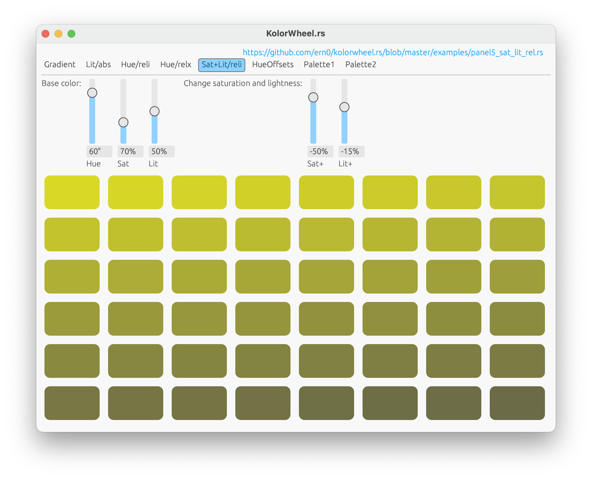

# KolorWheel.rs


## What is it?

This crate is designed 
to make it easy 
to create palettes for GUI applications.

> With a slightly different API, for a slightly different platform:
[KolorWheel.js](https://github.com/ern0/kolorwheel.js/)

The way of creating a palette is 
to specify a base color 
and some parameters 
that modifies the H, S, L values
in the given *spin mode* and steps.


## The HSL color model

In HSL color model, colors are defined by
*Hue*, *Saturation* and *Lightness*.

**Hue** is a circular dimension,
0° is red, 
180° is cyan, 
and 360° is also red.

**Saturation** goes from 0 to 100%,
0 is gray, 100% is the full color.

**Lightness** also goes from 0 to 100%,
0 is black, 100% is white.

Note that HSL color space is not linear.

- The closer the *saturation* is to zero,
  the less effect the *hue* has.
- If the *saturation* is 0,
  the *hue* is meaningless.
- The farther the *lightness* is from 50%,
  the less effect 
	*hue* and *saturation* have.
- If the *lightness* is 0 or 100%,
  *hue* and *saturation* 
	have no effect at all.
- Not all value triples are different colors,
  but different colors have different values.

Also note, 
converting a HSL value to RGB is trivial,
but converting RGB to HSL is not.
For example, `#000000` (black) color has
zero *lightness*, but
*hue* and *saturation* can be anything.


## The flaws of the HSL color model

The HSL model does not represent
how human vision actually works.

Linear changes in H, S, L values 
may not perceived linearly 
by the human eye.


## See also

- [Pastel](https://github.com/sharkdp/pastel): a nice command-line tool to generate, analyze, convert and manipulate colors
- [Kolorwheel.js documentation](http://linkbroker.hu/stuff/kolorwheel.js/): some docs and ideas


## Quick API overview

**Step 1**: create the `KolorWheel` object 
with base color and number of steps:
```
let base_color = HslColor::new(0, 100, 40);
let mut kw = KolorWheel::new(base_color, 10);

```

**Step 2**: define H/S/L absolute or relative changes:
```
kw.with_hue(SpinMode::Absolute(120));
kw.with_saturation(SpinMode::RelativeIncl(-15));

```

**Step 3**: optionally,
on top of absolute/relative changes,
offset array slices can be specified:
```
kw.with_lightness(SpinMode::Offset(&[0, 15, 30]));
```

**Step 4**: optionally, 
the result can be forked,
so each result item produces a separate
series of colors using item color as base color,
only the size of sub-series should be specified:
```
kw.fork(5);
kw.with_hue(SpinMode::RelativeIncl(45));
```
The number of overall items will be
the product of original and forked counts
(in this example: 10 * 5 = 50);

**Step 5**: the result can be get via
iterator, lambda or `vec`. The item type is
`HslColor`, which can be transformed
to `RgbColor`:
```
for hsl_color in kw {
    let rgb_color: RgbColor = hsl_color.into();
    //...
}
```

## API details


### Create `KolorWheel` object

#### `KolorWheel::new<T>(color: T, count: usize) -> Self`

Creates a `KolorWheel` object
with base parameters:

- `color`: base color, should be `HslColor` or
  any type which implements `Into<HslColor>`.
- `count`: number of steps of color transformation,
  including initial state.

Returns `KolorWheel` object,
which must be declared as mutable.


### Spin the wheel

These methods apply specified `SpinMode`
on the `KolorWheel` object.

They return mutable reference for chaining.

- `with_hue(&mut self, spin_mode: SpinMode) -> &mut KolorWheel`
- `with_saturation(&mut self, spin_mode: SpinMode) -> &mut KolorWheel`
- `with_lightness(&mut self, spin_mode: SpinMode) -> &mut KolorWheel`

The `SpinMode` enum lists the possible spin
operations.

Valid ranges for *hue* is 0 to 360°,
but upon overflow or underflow,
it will be normalized,
e.g. *365° -> 5°* or *-10° -> 350°*.

The *saturation* and *lightness* 
must be between 0 and 100%.
Upon overflow or underflow, 
they will be cut, 
e.g. *99% + 5% -> 100%* or *10% - 25% = 0*.

The API uses `i32` for degree and percent values.

```
pub enum SpinMode<'m> {
    Still,
    Absolute(i32),
    RelativeIncl(i32),
    RelativeExcl(i32),
    Offset(&'m [i32]),
}
```

- `Still`: defult value for no change, 
   may not be used in API calls.
- `Absolute`: set absolute target value.
- `RelativeIncl`: set relative target value.
   the target value will be included in the result.
- `RelativeIncl`: set relative target value,
   the target value will be excluded from the result.
   It's useful when the created palette is circular,
   the real target is the next round's first color,
   so the last color should be one step back.
- `Offset`: defines a list, which offsets the result.
   If the offset size is less than spin size,
   offsets will repeat.

A H/S/L component may have optionally one of
`Absolute`, `RelativeIncl` and `RelativeExcl`,
and optionally one `Offset` specified.


### Spin macros

This method applies specified `SpinMacro`
on the `KolorWheel` object.

It returns mutable reference for chaining.

`with_macro(&mut self, spin_macro: SpinMacro) -> &mut Self`

`SpinMacro` transformations are shourtcuts
to common ones,
they are implemented with `SpinMode` under the hood.

```
pub enum SpinMacro {
    GradientColor(HslColor),
    FadeToGray(i32),
    FadeToBlack,
    FadeToWhite,
}
```

- `GradientColor`: simple gradient,
  shorthand for
  setting absolute transformations for
  H, S and L.
  Target color should be `HslColor`,
  or any type which implements `Into<HslColor>`.
- `FadeToGray`: shorthand for
  transforming *saturation* to zero,
  and *lightness* to the specified value,
  aka. gray level.
- `FadeToBlack`: special case for `FadeToGray`,
  with *lightness* value of 0.
- `FadeToWhite`: special case for `FadeToGray`,
  with *lightness* value of 100%.


### Forking

Creates a new *spinner* for each result,
with results as base colors.

`fork(&mut self, count: usize) -> &mut Self`

- `count`: the number of steps for 
  the inner spinner.
  
Returns mutable reference for chaining.

The overall steps will be the product value of
all `count` parameters, e.g. the initial
value in constructor, 
and ones specified in `fork()` calls.

For example, 
- create a `KolorWheel` with
  base color of red and 4 steps,
- add transformation
  `SpinMode::Absolute` to blue, then
- call `fork()` with count of 10
  and add a macro transformation
  `SpinMacro::FadeToWhite`.

What we get:
- the result's first color will be red, then
- it fades to white in 10 steps.
- The 11th color will be violet 
  (1/4 step closer to blue), and
- it will be faded to white in 10 steps,

...and so on.
The total number of results will be *4 * 10 = 40*.


### Result

There are three way of getting the result:
- iterator,
- vector,
- callback.

The result item is always `HslColor`,
which can be converted to `RgbColor`
using `From` and `Into` traits:
```
pub struct RgbColor {
    pub r: u8, 
    pub g: u8, 
    pub b: u8,
}
```

#### Iterator

The most convenient way to get through the result
is using `KolorWheel` as iterator:

```
let mut kw = KolorWheel::new( ... );
...
for hsl_color in kw {
  let rgb_color: RgbColor = hsl_color.into();
  ...
}
```

#### Callback

The `spin()` method is calling the callback 
with each result value:
```
KolorWheel::new( ... )
    ...
    .spin(&mut|hsl_color: HslColor| { 
        ...
    })
;
```

#### Vector

Use `spin_vec()` to get the results in a `vec<T>`.
```
let result = KolorWheel::new( ... )
    ...
    .spin_vec::<HslColor>()
;
```
The result stored in the `vec<T>` can be any `T` type,
which implements `From<HslColor>` trait.


## Examples

The `examples/` directory contains 
a small GUI app (using *egui*)
with some example panels,
which demonstrate the main functions of the library.

How to build and run the example app:
```
cargo run --example main
```

### 1: Gradient

The transition between two colors 
lacks imagination and creativity, 
but there's a macro for it, obviously.


```
let mut kw = KolorWheel::new(self.color1, 5*5);
kw.with_macro(SpinMacro::GradientColor(self.color2));
```

*See [full example](https://github.com/ern0/kolorwheel.rs/blob/master/examples/panel1_gradient.rs) for details.*


### 2: Lit/abs

It's common to 
simply darken or lighten a color by
specifying a target lightness value.


```
let mut kw = KolorWheel::new(self.color, 4*4);
kw.with_lightness(SpinMode::Absolute(self.lit));
```

*See [full example](https://github.com/ern0/kolorwheel.rs/blob/master/examples/panel2_lit_abs.rs) for details.*


### 3-4: Hue/reli, Hue/relx

For a relative value, it is important 
whether the last step is included in the result,
especially in case of hue transformation.

If you only display the generated palette once,
the last value should be the specified one.


```
let mut kw = KolorWheel::new(self.color, 3*2);
kw.with_hue(SpinMode::RelativeIncl(self.hue));
```

If you display the generated palette more than once,
endless or circular fashion,
the last item will match the next round's first one,
so it should be omitted.


```
let mut kw = KolorWheel::new(self.color, 3*2);
kw.with_hue(SpinMode::RelativeExcl(self.hue));
```

*See [full example](https://github.com/ern0/kolorwheel.rs/blob/master/examples/panel3_p4_hue_rel_univ.rs) for details.*

### 5: Sat+Lit/rel

One of the most common transformations is
altering saturation and lightness together
while keeping the hue unchanged.



```
let mut kw = KolorWheel::new(self.color, 8*6);
kw.with_saturation(SpinMode::RelativeIncl(self.sat));
kw.with_lightness(SpinMode::RelativeIncl(self.lit));
```

*See [full example](https://github.com/ern0/kolorwheel.rs/blob/master/examples/panel5_sat_lit_rel.rs) for details.*


### 6: HueOffsets

On top of the calculated transformations,
an array (slice) of offsets can be applied
on any channel. 
In this example, 
on each item of the outer gradient,
an inner transformation is applied,
which is simply a series of hue offsets.
You can see the outer transformation 
on the original hue
in the first and fifth row.


```
let mut kw = KolorWheel::new(self.color1, self.rows);
kw.with_macro(SpinMacro::GradientColor(self.color2));
kw.fork(self.count);
kw.with_hue(SpinMode::Offset(&self.values[0 .. self.cols]));
```

*See [full example](https://github.com/ern0/kolorwheel.rs/blob/master/examples/panel6_.rs) for details.*


### 7: Palette1

If the values are chosen carefully,
calculated transformations and offseting
can be used on the same channel.


```
color: HslColor::new(20, 70, 60),
hue_offsets: [0, 0, 0, 0, 120],
lit_offsets: [0, 0, 0, 0, -60],
  (...)
let mut kw = KolorWheel::new(self.color, 5);
kw.with_hue(SpinMode::RelativeIncl(75));
kw.with_hue(SpinMode::Offset(&self.hue_offsets[0..5]));
kw.with_lightness(SpinMode::RelativeIncl(30));
kw.with_lightness(SpinMode::Offset(&self.lit_offsets[0..5]));
```

*See [full example](https://github.com/ern0/kolorwheel.rs/blob/master/examples/panel7_palette1.rs) for details.*


### 8: Palette2

While calculated transformations 
describe a base palette,
offset values can be used to
give specific items a function,
e.g. a darker color can be used as
font color.


```
color: HslColor::new(240, 80, 70),
sat_offsets: [60, 0, 0, 70, 0, 0],
lit_offsets: [-40, 0, 0],
  (...)
let mut kw = KolorWheel::new(self.color, 3*2);
kw.with_hue(SpinMode::RelativeIncl(90));
kw.with_saturation(SpinMode::RelativeIncl(-20));
kw.with_saturation(SpinMode::Offset(&self.sat_offsets[0..6]));
kw.with_lightness(SpinMode::Offset(&self.lit_offsets[0..3]));
```

*See [full example](https://github.com/ern0/kolorwheel.rs/blob/master/examples/panel8_palette2.rs) for details.*

